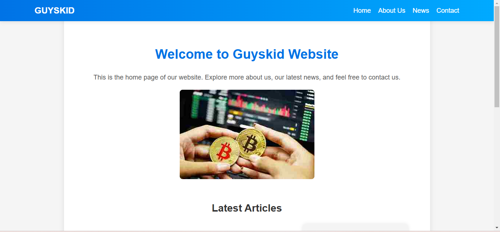
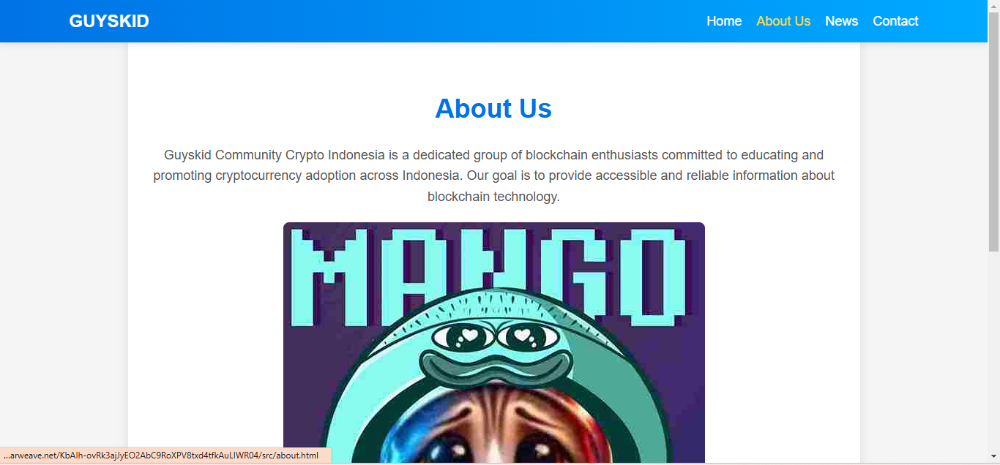
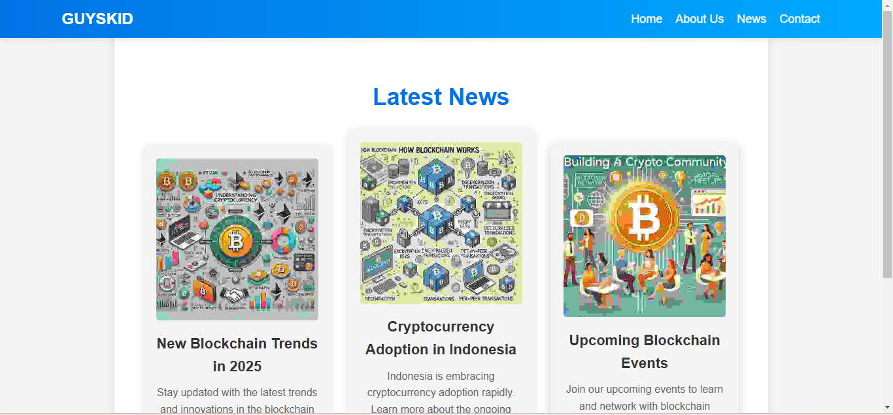

# Guyskid Website

You can access this website it at: [Guyskid](https://fgyarb7kf5de3wumtscdwya3bpkgqxhvps3ro6fv7ealrmqwi5ha.arweave.net/KbAIh-ovRk3ajJyEO2AbC9RoXPV8txd4tfkAuLIWR04/)

## Screenshots Website Menu

## Description

Guyskid Website Cryptocurrency is a digital asset designed to work as a medium of exchange that uses cryptography to secure financial transactions. 

this website deploy use [Dragondeploy](https://dragondeploy.xyz/)

## Project Structure

- `assets/css/style.css`: Styles for the website.
- `assets/images/`: Contains images used in the website.
- `src/about.html`: About Us page.
- `src/contact.html`: Contact page.
- `src/news.html`: About Us page.
- `index.html`: Home page.

## Deploying to Dragondeploy

### 1. Preparing Your Project

before your deploy check your project, make sure you have the following files and folders in your project directory. after that
you can visiting the [Dragondeploy](https://dragondeploy.xyz/)

### 2. Connecting and Setting Permision Wallet

Before your upload file project you should configure permision.
you can visiting [Setting Permision](https://dragondeploy.xyz/pro-tips)

### 3. Uploading Your Files

Drag and drop your project folder directly into DragonDeploy and verification your project with your wallet. Press accept to confirm the project. and then when it is finished, a link will appear to access your project.
